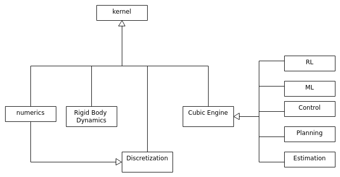

# Cubic Engine

Various algorithms on numerics, control, reinforcement learning and machine learning. The functionality is  split into
modules compiled into dynamic libraries. This is shown in the figure below



## Dependencies

- A C++17 compatible compiler
- <a href="https://www.boost.org/">Boost C++</a> libraries
- <a href="https://bitbucket.org/blaze-lib/blaze/wiki/browse/">Blaze</a> library for linear algebra
- <a href="https://github.com/google/googletest">GTest</a> if testing is enabled
- <a href="https://github.com/trilinos/Trilinos">Trilinos</a> if it is enabled.
- <a href="https://github.com/Neargye/magic_enum">```magic_enum```</a> only used if ```__GNUC__ >7 ```
- <a href="https://github.com/nlohmann/json">Nlohmann JSON</a> used for JSON support

## Installation

Installing the libraries is done via a ```config_opts.json``` file. Some of the  options are explained
below. 


- ```BUILD_LIBS``` Flag indicating if the python script should build the libraries
- ```CMAKE_BUILD_TYPE``` Build mode options ```RELEASE``` or ```DEBUG```
- ```CMAKE_CXX_COMPILER``` C++ Compiler
- ```CMAKE_C_COMPILER``` C Compiler
- ```BLAZE_INCL_DIR``` Path to the ```blaze``` library
- ```NLOHMANN_JSON_INCL_DIR```  Path to the ```nlohman_json``` library 
- ```GTEST_INC_DIR``` Path to GTest include directory
- ```GTEST_LIB_DIR``` Path to the GTest library "/home/alex/MySoftware/gtest/install/lib"
- ```USE_TRILINOS``` Flag indicating if Trilinos is to be used
- ```USE_TRILINOS_LONG_LONG_TYPE``` Flag indicating if C++ long long type is used with Trilinos
- ```TRILINOS_INCL_DIR``` Path to Trilinos header files
- ```TRILINOS_LIB_DIR``` Path to Trilinos libraries
- ```USE_OPEN_CV``` Flag indicating if OpenCV is to be used
- ```OPENCV_INCL_DIR``` Path to OpenCV headers 
- ```CMAKE_INSTALL_PREFIX``` Where the libraries should be installed
- ```USE_DISCRETIZATION``` Generate CMakeLists for discretization library
- ```USE_NUMERICS``` Generate CMakeLists for numerics library
- ```USE_RIGID_BODY_DYNAMICS``` Generate CMakeLists for rigid body dynamics library
- ```USE_FVM``` Use finite volume method
- ```BUILD_KERNEL_TESTS``` Flag indicating if tests should be build
- ```BUILD_KERNEL_EXAMPLES``` Flag indicating if examples should be build
- ```USE_RL``` Flag indicating if RL library should be build
- ```USE_ML``` Flag indicating if ML library should be build
- ```USE_ESTIMATION``` Flag indicating if estimation library should be build
- ```USE_PLANNING``` Flag indicating if planning library should be build
- ```USE_CONTROL``` Flag indicating if control library should be build
     
After specifying the options, execute the ```configure.py``` script.


```
python configure.py
```

## Documentation

You can find the HTML documentation <a href="https://pockerman.github.io/cubic_engine_doc/">here</a>

## Examples

You can find some example applications below

- <a href="kernel/README.md">kernel</a>
- <a href="cubic_engine/README.md">cengine</a>

## Images (some are simply wrong :) )


