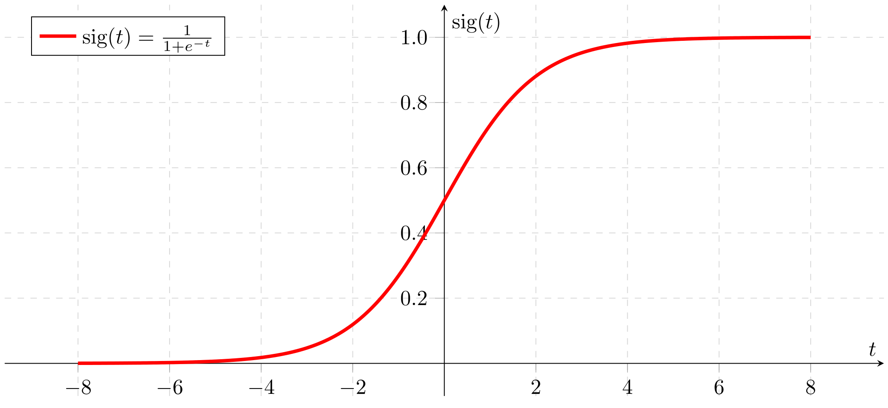

# Example 12: Logistic Regression 

## Contents
* [Acknowledgements](#ackw)
* [Overview](#overview) 
		* [Logistic Regression](#logistic_regression)
		* [Error Metrics](#error_metrics)
			*[Confusion Matrix](#confusion_matrix)
			*[Accuracy](#accuracy)
			*[Recall or Sensitivity](#recall_or_Sensitivity)
			*[Precision](#precision)
			*[Specificity](#specificity)
			*[F1-score](#f1_score)
* [Include files](#include_files)
* [Program structure](#prg_struct)
* [The main function](#m_func)
* [Results](#results)
* [Source Code](#source_code)

## <a name="ackw"></a>  Acknowledgements

## <a name="overview"></a> Overview

Example 11 discussed the linear regression model. This example is concerned with classification and in particular classification using
the so-called logistic regression model. Classification is merely a technique that allows us to distinguish or classify items into
classes (checkout the wikipedia article <a href="https://en.wikipedia.org/wiki/Statistical_classification">statistical classification</a>).
There are several models in order to classify items in a data set. Perhaps one of the simplest  is the logistic regression 
model (see wikipedia entry <a href="https://en.wikipedia.org/wiki/Logistic_regression">logistic regression</a> for more details). 

### <a name="logistic_regression"></a> Logistic Regression

### <a name="error_metrics"></a> Error Metrics

So we established the logistic regression model but how can we measure how good it is? There are various metrics to do so

- Confusion matrix
- Accuracy
- Recall or sensitivity
- Precision
- Specificity
- F1-score

Let's see what all these are. 

#### <a name="confusion_matrix"></a> Confusion Matrix

A confusion matrix is simply  a table layout that allows visualization of the performance of an algorithm. 
Each row of the matrix represents the instances in a predicted class while each column represents the instances in an actual class (or vice versa).
For more information, see the wikipedia entry <a href="https://en.wikipedia.org/wiki/Confusion_matrix">Confusion matrix</a> 

#### <a name="accuracy"></a> Accuracy

Accuracy answers the following question: Overall how often is the classifier correct? It is defined as
as the sum of the diagonal terms over the total number of examples


The opossite of accuracy is the misclassification rate which answers the question: Overall how often is the classifier
wrong? It is defined as the sum of off diagonal terms over the total number of points. Being however the opposite of accuracy we can also
calculate it as one minus accuracy.

#### <a name="recall_or_Sensitivity"></a> Recall or Sensitivity

#### <a name="precision"></a> Precision

Precision answers the following question. When it predicts Yes how often is it correct?

#### <a name="specificity"></a> Specificity

Specificity or True Negative Rate answers the following question: When it is actually No how often the classifier predicts No?
Specificity is one minus the false Positive Rate


#### <a name="f1_score"></a> F1-score




## <a name="include_files"></a> Include files

```
#include "cubic_engine/base/cubic_engine_types.h"
#include "cubic_engine/ml/supervised_learning/logistic_regression.h"
#include "cubic_engine/optimization/serial_batch_gradient_descent.h"
#include "cubic_engine/optimization/utils/gd_control.h"

#include "kernel/maths/functions/real_vector_polynomial.h"
#include "kernel/maths/errorfunctions/mse_function.h"
#include "kernel/maths/functions/sigmoid_function.h"
#include "kernel/utilities/data_set_loaders.h"

#include <iostream>
```
## <a name="prg_struct"></a> Program structure

## <a name="m_func"></a> The main function

```
int main(){

    using cengine::uint_t;
    using cengine::real_t;
    using cengine::DynMat;
    using cengine::DynVec;
    using cengine::GDControl;
    using cengine::Gd;
    using cengine::LogisticRegression;
    using kernel::RealVectorPolynomialFunction;
    using kernel::MSEFunction;
    using kernel::SigmoidFunction;

    try{

        auto dataset = kernel::load_reduced_iris_data_set();

        // the classifier to use. use a hypothesis of the form
        // f = w_0 + w_1*x_1 + w_2*x_2 + w_3*x_3 + w_4*x_4;
        // set initial weights to 0
        LogisticRegression<RealVectorPolynomialFunction,
                          SigmoidFunction<RealVectorPolynomialFunction>> classifier({0.0, 0.0, 0.0, 0.0, 0.0});

        SigmoidFunction<RealVectorPolynomialFunction> sigmoid_h(classifier.get_model());

        // the error function to to use for measuring the error
        MSEFunction<SigmoidFunction<RealVectorPolynomialFunction>,
                    DynMat<real_t>,
                    DynVec<uint_t>> mse(sigmoid_h);

        GDControl control(10000, kernel::KernelConsts::tolerance(), GDControl::DEFAULT_LEARNING_RATE);
        control.show_iterations = false;
        Gd gd(control);

        auto result = classifier.train(dataset.first, dataset.second, gd, mse);
        std::cout<<result<<std::endl;

        DynVec<real_t> point{1.0, 5.7, 2.8, 4.1, 1.3};
        auto class_idx = classifier.predict(point);

        std::cout<<"Class index: "<<class_idx<<std::endl;
    }
    catch(std::exception& e){

        std::cerr<<e.what()<<std::endl;
    }
    catch(...){

        std::cerr<<"Unknown exception occured"<<std::endl;
    }

    return 0;
}

```

## <a name="results"></a> Results

## <a name="source_code"></a> Source Code

<a href="../exe.cpp">exe.cpp</a>
